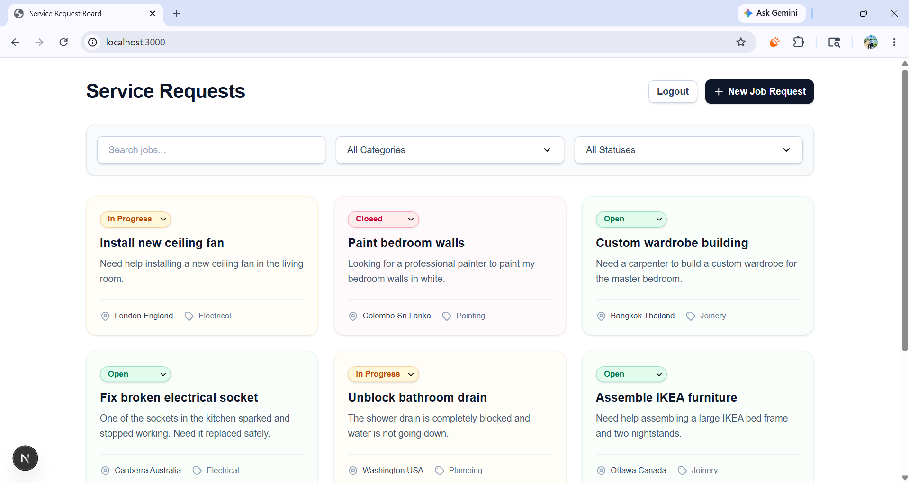
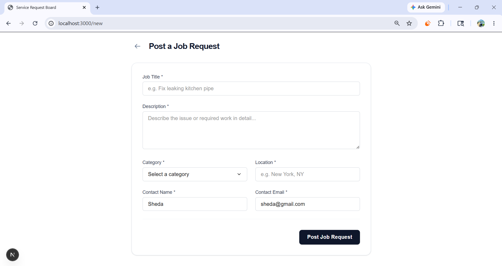
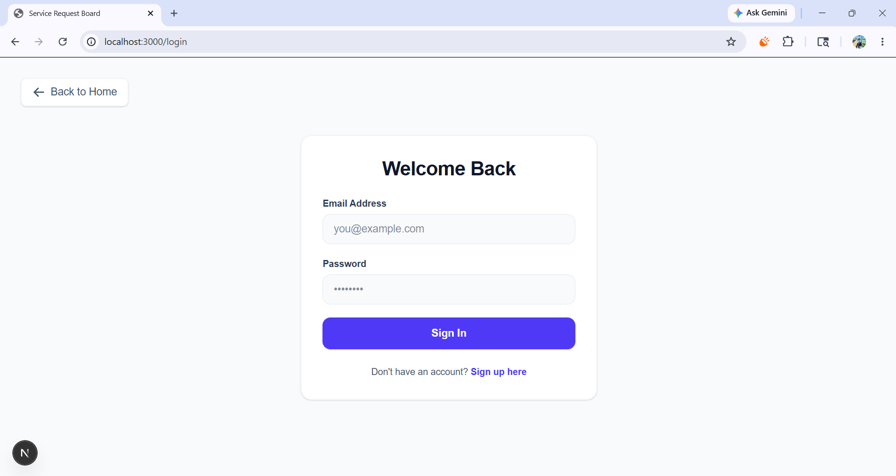
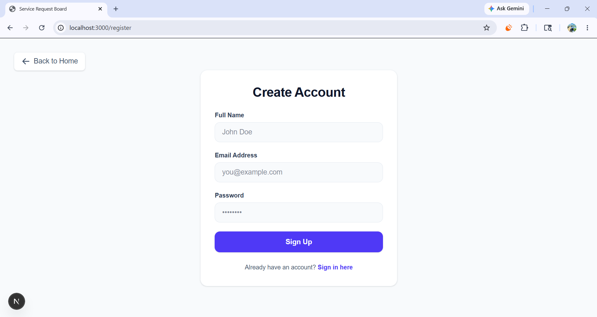

# Service Request Board


A full-stack web application built for the GlobalTNA Full-Stack Developer Intern technical assessment. This application serves as a "Service Request Board" where users can post service requests (e.g., plumbing, electrical) and view open jobs, update their statuses, or delete them.

## Live Demo
- **Frontend (Vercel):** https://service-request-board-pearl.vercel.app
- **Backend API (Railway):** https://service-request-board-backend-production-68fd.up.railway.app

## Features
- **Job Board:** View a list of all active service requests.
- **Filtering & Search:** Filter jobs by Category, Status, or keyword search.
- **Authentication:** JWT-based user registration and login.
- **Protected Actions:** Only authenticated users can create or delete job requests.
- **Status Management:** Quickly update a job's status (Open, In Progress, Closed).
- **Global Error Handling:** Consistent API error responses and validation handling.

## Usage Flow
1. **Register or Login** to access protected features.
2. **Browse Jobs** on the main dashboard, using filters as needed.
3. **Create a New Job Request** by filling out the form.
4. **Update Status** of any open job (Open, In Progress, Closed).
5. **Delete Job** (restricted to authenticated users).

## Tech Stack
**Frontend:**
- Next.js (App Router)
- React
- Tailwind CSS
- Axios

**Backend:**
- Node.js & Express.js
- MongoDB & Mongoose
- JSON Web Tokens (JWT) & bcryptjs
- Vitest & Supertest (for API Testing)

## Folder Structure
```
service-request-board/
├── client/                 # Next.js Frontend Application
│   ├── app/                # Next.js App Router pages
│   ├── components/         # Reusable React components
│   ├── services/           # Axios API services
│   └── lib/                # Constants and API interceptor
├── server/                 # Express.js Backend Application
│   ├── controllers/        # Request handlers
│   ├── models/             # Mongoose schemas
│   ├── routes/             # Express routes
│   ├── middleware/         # Auth & Error handling
│   └── tests/              # Vitest API tests
└── README.md               # Project documentation
```

## Environment Variables
To run this project locally, you will need to add environment variables. Example files are provided in both the `client` and `server` directories.

**Client (`client/.env.local`):**
```env
NEXT_PUBLIC_API_URL=http://localhost:5000/api
```

**Server (`server/.env`):**
```env
PORT=5000
MONGO_URI=mongodb://127.0.0.1:27017/service-board
JWT_SECRET=your_secret_key
```

## Running Locally

### 1. Clone the repository
```bash
git clone https://github.com/sheda3838/service-request-board.git
cd service-request-board
```

### 2. Backend Setup
```bash
cd server
npm install
# Create your .env file based on .env.example
npm run dev
```

### 3. Frontend Setup
Open a new terminal window:
```bash
cd client
npm install
# Create your .env.local file based on .env.example
npm run dev
```

## Running Tests (Backend)
The backend includes unit tests for the API endpoints using Vitest and Supertest.
```bash
cd server
npm test
```

## Seeding the Database
You can populate the database with dummy user data and sample job requests.
```bash
cd server
node scripts/seed.js
```

## API Endpoints
| HTTP Method | Endpoint | Description | Protected |
| ----------- | -------- | ----------- | --------- |
| `POST` | `/api/auth/register` | Register a new user | No |
| `POST` | `/api/auth/login` | Authenticate user | No |
| `GET` | `/api/jobs` | Get all jobs (supports filters) | No |
| `GET` | `/api/jobs/:id` | Get job by ID | No |
| `POST` | `/api/jobs` | Create a new job | **Yes** |
| `PATCH` | `/api/jobs/:id` | Update job status | No |
| `DELETE`| `/api/jobs/:id` | Delete a job | **Yes** |

*(Note: JWT tokens must be passed in the `Authorization: Bearer <token>` header for protected routes.)*

## Screenshots





## Future Improvements
While the assessment is complete, future iterations of this project could include:
- **Pagination**: Adding `limit` and `skip` query parameters to the GET jobs endpoint to handle large datasets.
- **Better Validation**: Implementing a validation layer like Express Validator or Zod at the router level.
- **Role-Based Access**: Adding a dedicated "Tradesperson" role with specific permissions.

## Author
**Kamil Zaid**
- GitHub: https://github.com/sheda3838
- Email: kamilzaid53@gmail.com 
